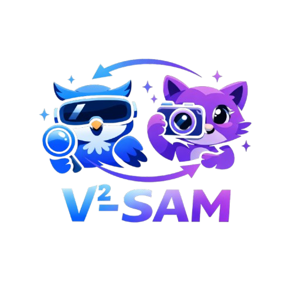
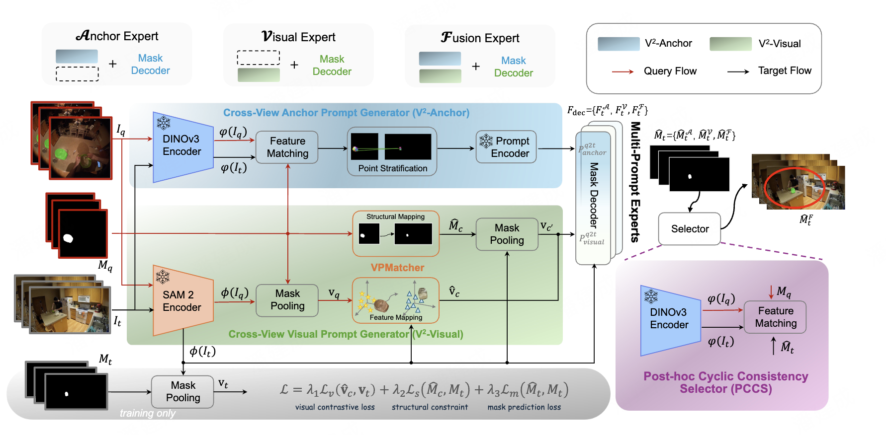

<p align="center">
    
</p>
<div align="center">
<h1 align="center">
V²-SAM: Marrying SAM2 with Multi-Prompt Experts for Cross-View Object Correspondence
</h1>
<h4 align="center"><em>Jiancheng Pan*,     Runze Wang*,     Tianwen Qian,     Mohammad Mahdi,     Xiangyang Xue,</em></h4>
<h4 align="center"><em>Xiaomeng Huang,     Luc Van Gool,     Danda Pani Paudel,     Yuqian Fu✉ </em></h4>
<p align="center">
    
</p>

\* *Equal Contribution* &nbsp; &nbsp; Corresponding Author ✉
</div>

<p align="center">
    <a href="https://arxiv.org/abs/2511.20886"></a>
    <a href="https://arxiv.org/abs/2511.20886"></a>
    <a href="https://huggingface.co/jaychempan/V2-SAM"></a>
    <a href="https://jianchengpan.space/projects/V2-SAM/"></a>
    <a href="https://github.com/jaychempan/V2SAM/blob/main/LICENSE"></a>
</p>

<p align="center">
  <a href="#news">News</a> |
  <a href="#abstract">Abstract</a> |
  <a href="#dataset">Dataset</a> |
  <a href="#model">Model</a> |
  <a href="#statement">Statement</a>
</p>


## News
- [2026/2/21] Our V²-SAM is accepted by CVPR 2026. Thanks to all contributors.
- [2025/11/25] Our paper of "V²-SAM: Marrying SAM2 with Multi-Prompt Experts for Cross-View Object Correspondence" is up on [arXiv](https://arxiv.org/abs/2511.20886).

## Abstract
Cross-view object correspondence, exemplified by the representative task of ego-exo object correspondence, aims to establish consistent associations of the same object across different viewpoints (e.g., ego-centric and exo-centric). This task poses significant challenges due to drastic viewpoint and appearance variations, making existing segmentation models, such as SAM2, non-trivial to apply directly. To address this, we present V2-SAM, a unified cross-view object correspondence framework that adapts SAM2 from single-view segmentation to cross-view correspondence through two complementary prompt generators. Specifically, the Cross-View Anchor Prompt Generator (V2-Anchor), built upon DINOv3 features, establishes geometry-aware correspondences and, for the first time, unlocks coordinate-based prompting for SAM2 in cross-view scenarios, while the Cross-View Visual Prompt Generator (V2-Visual) enhances appearance-guided cues via a novel visual prompt matcher that aligns ego-exo representations from both feature and structural perspectives. To effectively exploit the strengths of both prompts, we further adopt a multi-expert design and introduce a Post-hoc Cyclic Consistency Selector (PCCS) that adaptively selects the most reliable expert based on cyclic consistency. Extensive experiments validate the effectiveness of V2-SAM, achieving new state-of-the-art performance on Ego-Exo4D (ego-exo object correspondence), DAVIS-2017 (video object tracking), and HANDAL-X (robotic-ready cross-view correspondence).

<p align="center">
    
</p>

## Dataset
Our method based on Ego-Exo4D (ego-exo object correspondence), DAVIS-2017 (video object tracking), and HANDAL-X (robotic-ready cross-view correspondence).

We provide the processed versions of these datasets on HuggingFace for easy access:

### 🔹 Ego-Exo4D
- [Train Split](https://huggingface.co/datasets/jaychempan/Ego-Exo4D-Relation-Train)
- [Test Split](https://huggingface.co/datasets/jaychempan/Ego-Exo4D-Relation-Test)

### 🔹 DAVIS-2017
- [Dataset Link](https://huggingface.co/datasets/jaychempan/DAVIS)

### 🔹 HANDAL-X
- [Dataset Link](https://huggingface.co/datasets/jaychempan/HANDAL)

## Model
### Environment Setup

```
conda create -n v2sam python=3.10 -y
conda activate v2sam
cd ~/projects/V2-SAM
export LD_LIBRARY_PATH=/opt/modules/nvidia-cuda-12.1.0/lib64:$LD_LIBRARY_PATH
export PATH=/opt/modules/nvidia-cuda-12.1.0/bin:$PATH
# conda install pytorch==2.3.1 torchvision==0.18.1 pytorch-cuda=12.1 cuda -c pytorch  -c "nvidia/label/cuda-12.1.0" -c "nvidia/label/cuda-12.1.1"
pip install torch==2.3.1 torchvision==0.18.1 torchaudio==2.3.1 --index-url https://download.pytorch.org/whl/cu121

# pip install mmcv==2.1.0 -f https://download.openmmlab.com/mmcv/dist/cu121/torch2.3/index.html 
pip install -U openmim
mim install mmengine
mim install "mmcv>=2.1.0"
pip install -r requirements.txt
pip install prettytable

# use local mmengine for use the thrid party tools
cd mmengine
pip install -e .
```

### SAM2 and DINOV3 weights
Choose the base model weights to use.
```
huggingface-cli download jaychempan/sam2 --local-dir weights/sam2 --include sam2_hiera_large.pt

huggingface-cli download jaychempan/dinov2 --local-dir weights/dinov2 --include dinov2_vitg14_reg4_pretrain.pth

huggingface-cli download jaychempan/dinov3 --local-dir weights/dinov3 --include dinov3_vitl16_pretrain_lvd1689m-8aa4cbdd.pth
```


### Train

```
bash tools/dist.sh train projects/v2sam/configs/v2sam.py 4
```
if `V²-Visual`, rename the project's dir `projects/v2sam_visual` --> `projects/v2sam`

else `V²-Fusion`, rename the project's dir `projects/v2sam_fusion` --> `projects/v2sam`

> Note: `V²-Anchor` no need to train (use sam2 offical decoder checkpoint)

### Test

```
bash tools/test.sh test projects/v2sam/configs/v2sam.py 4 /path/to/checkpoint

bash tools/test_all.sh test projects/v2sam/configs/v2sam.py 4 /path/to/checkpoint/dir
```

## Statement
### Acknowledgement

This project references and uses the following open source models and datasets.

#### Related Open Source Models

- [Sa2VA](https://arxiv.org/abs/2501.04001)
- [SAM2](https://arxiv.org/abs/2408.00714)
- [DINOv2](https://arxiv.org/abs/2304.07193)
- [DINOv3](https://arxiv.org/abs/2508.10104)

#### Related Open Source Datasets

- [Ego-Exo4D Dataset](https://ego-exo4d-data.org/)
- [DAVIS-2017 Dataset](https://davischallenge.org/davis2017/code.html)
- [HANDAL-X Dataset](https://nvlabs.github.io/HANDAL/)


### Citation

If you are interested in the following work or want to use our dataset, please cite the following paper.

```bibtex
@inproceedings{pan2026v,
  title={V$^{2}$-SAM: Marrying SAM2 with Multi-Prompt Experts for Cross-View Object Correspondence},
  author={Pan, Jiancheng and Wang, Runze and Qian, Tianwen and Mahdi, Mohammad and Fu, Yanwei and Xue, Xiangyang and Huang, Xiaomeng and Van Gool, Luc and Paudel, Danda Pani and Fu, Yuqian},
  booktitle={CVPR},
  year={2026}
}

@inproceedings{fu2025objectrelator,
  title={Objectrelator: Enabling cross-view object relation understanding across ego-centric and exo-centric perspectives},
  author={Fu, Yuqian and Wang, Runze and Ren, Bin and Sun, Guolei and Gong, Biao and Fu, Yanwei and Paudel, Danda Pani and Huang, Xuanjing and Van Gool, Luc},
  booktitle={ICCV},
  year={2025}
}
```
